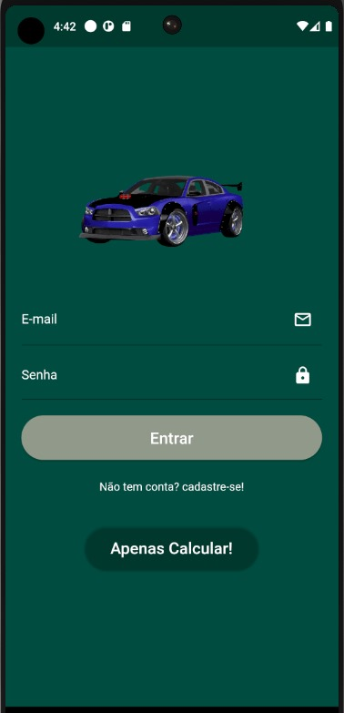
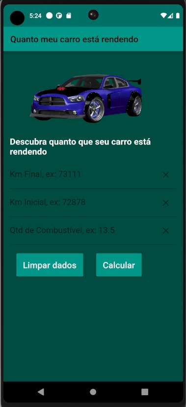

# Aplicativo

**Nome do Aplicativo:** Quanto_Rende
**Autor do Aplicativo:** Henrique Ribeiro
**Licença do Aplicativo:** MIT License
**Tecnologia do Aplicativo:** Flutter v2.10.4

## Descrição

Descubra quanto Km por litro faz o seu carro

## Pages Login e Home

## Funcionalidades

- Calcular Km por litro que faz o seu carro

<!-- ## Requisitos

- [Listar os requisitos para executar o aplicativo.] -->

## Instalação

1. flutter pub get
2. ...

<!-- ## Uso

[Instruções sobre como usar o aplicativo.] -->

## Contribuição

1. Fork it (<https://github.com/yourname/yourproject/fork>)
2. Create your feature branch (`git checkout -b feature/fooBar`)
3. Commit your changes (`git commit -am 'Add some fooBar'`)
4. Push to the branch (`git push origin feature/fooBar`)
5. Create a new Pull Request

## Licença

Este projeto está licenciado sob a Licença MIT - consulte o arquivo [LICENSE](LICENSE) para obter mais detalhes.

## Contato

Henrique Ribeiro – ribeiro.henriquem@gmail.com

---

*Fique a vontade para entrar em contato atravez do e-mail.*